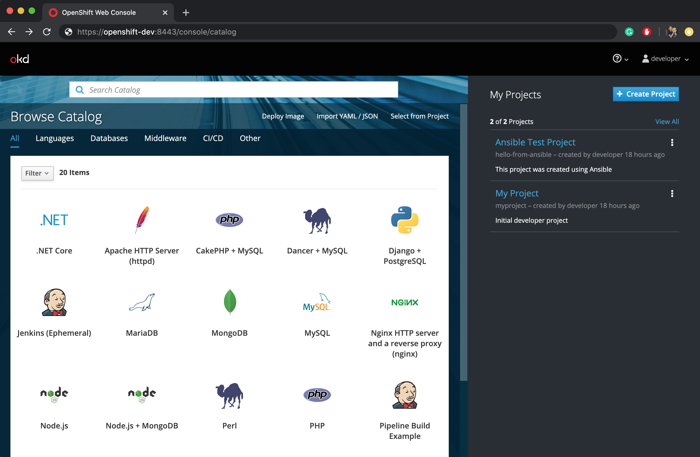

## Complete Openshift OKD deployment on Ubuntu using Ansible.

If you want the console to be available by a specific hostname or ip address, 
change the command in openshift.yml from: 
```oc cluster up```  to
```oc cluster up --public-hostname=your-hostname-or-ip```

### Execute the following command:
```ansible-playbook openshift.yml -i config/hosts.yml -vvvv --ask-pass -K```

After successful deployment, and logging into the Openshift console using developer account,
you should see **Ansible Test Project** in the projects section.




### Tested on Ubuntu 20.04 LTS